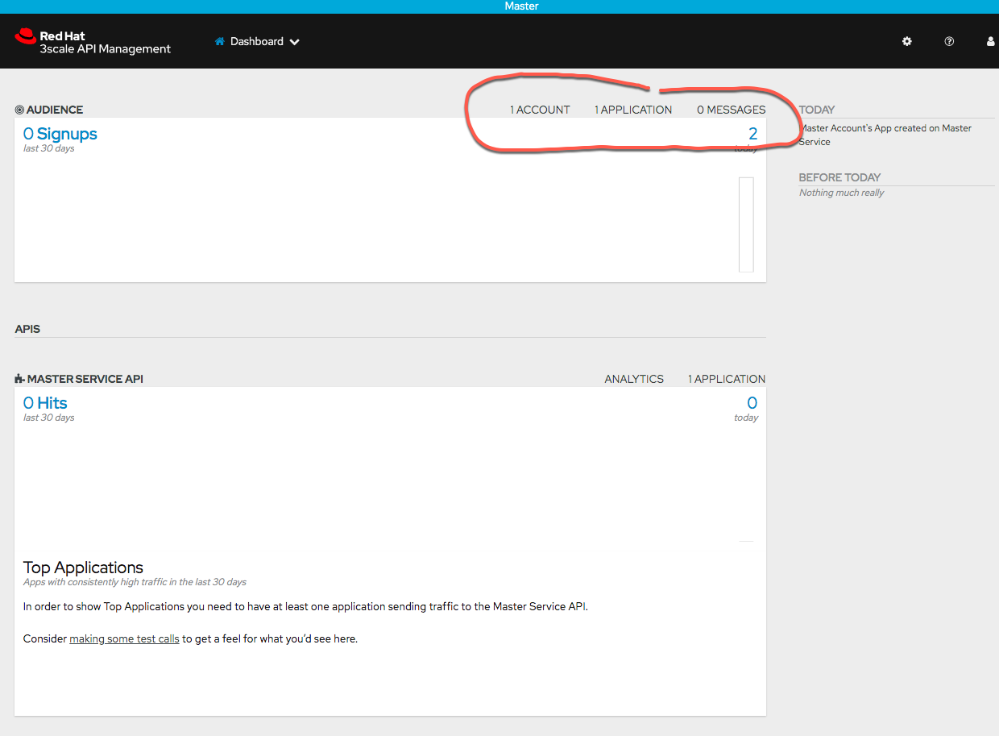

= Red Hat OpenShift Service Mesh Advanced - Instuctor Notes

:numbered:

== *OCP Cluster *
. Provision your own OCP 4.6 environment

. Instructor uses _MachineSet API_ to scale to appropriately sized cluster
.. Emergency Response (16GB RAM) + Istio Control Plane (6GB RAM) = 22GB RAM per student
.. Provision 1 worker node per 2 students.

.. Login to the OCP Environment as cluster administrator
+
----
$ oc login <<CLASSROOM-OCP-ENVIRONMENT>> -u opentlc-mgr
----

.. Find the currently available machinesets: oc get machinesets -n openshift-machine-api
+
----
$ oc get machinesets -n openshift-machine-api
----

.. Scale up a machineset, using this command:
+
----
$ oc scale machineset <MACHINESETNAME> --replicas=<COUNT> -n openshift-machine-api
----

.. Wait until all of the machinesets are READY and AVAILABLE.
+
----
$ oc get machinesets -n openshift-machine-api -w
----

== Configure Environment to Stay Up
During the course, you want the environment to stay up, without idling. You can set this in the CloudForms UI.

. Select your service, then select *Admin* drop-down
. Select *Unidle*

image::images/admin-unidle.png[]
 
== Prep Provisioning Environment

You will need an environment to run the Ansible provisioning playbooks. 

NOTE: If you are using a Mac, it is best to run the installation from a Linux environment. You can order a *Student VM* from OPENTLC. Once the environment is created then you'll need to ssh into Student VM and run the installation commands in this document.

=== Install Python Package Manager - pip

. Download and install pip
+
----
$ curl "https://bootstrap.pypa.io/get-pip.py" -o "get-pip.py"

$ python get-pip.py
----

. Verify The Installation
+
----
$ pip --version
----

=== Install Supporting Python Packages

The installation requires Python modules https://lxml.de/[lxml] and https://pypi.org/project/openshift/[openshift]

. Install lxml python module
+
----
$ sudo pip3 install lxml
----

. Install OpenShift python module
+
----
$ sudo pip3 install openshift==0.11.2
----

=== Install Ansible Tooling

The installation requires Ansible tooling

. Install Ansible
+
----
$ sudo dnf -y install ansible
----

== 3scale Control Plane

The 3scale installation process has three major steps:

.. Provision 1 3scale Control Plane
.. Provision 1 tenant per student
.. Provision 1 set of API gateways (staging and production) per tenant

=== 3scale Workload Overview

This workload provisions a single centralized 3scale API Manager in a single OCP namespace.

This workload only needs to be executed once per OCP cluster.

It also allows for management (ie: creation / deletion) of a configurable number of API _tenants_ in the 3scale API Manager installation.

This role might be valuable in the following circumstances:

. *Instructor Led Training (ILTs), Hackathons and workshops*:
+
Given X number of students in an ILT requiring 3scale, provision a single central multi-tenant Red Hat 3scale API Manager where each student is assigned their own tenant.
+
The student is provided with administrative credentials to their assigned tenant.
+
This approach might be more desirable than the alternative where each student provisions their own 3scale API Manager.

=== 3scale Deployment

. Log into the OCP environment as cluster manager
+
----
$ oc login <<CLASSROOM-OCP-ENVIRONMENT>> -u opentlc-mgr
----

=== Environment Variables

. Set up environment variables
+
----
$ echo "export OCP_AMP_ADMIN_ID=api0" >> ~/.bashrc 

$ echo "export API_MANAGER_NS=3scale-mt-\$OCP_AMP_ADMIN_ID" >> ~/.bashrc
----
** `OCP_AMP_ADMIN_ID`: OCP user that owns OCP namespace where mult-tenant 3scale resides. A cluster quota is assigned to this user. Note, this OCP user doesn't necessarily need to exist.
** `API_MANAGER_NS`: OCP namespace where 3scale API Manager resides

. Execute the following:
+
----
$ source ~/.bashrc
----

. SMTP Configurations
.. The following SMTP configurations are set to null values, since the labs do not require 3scale to send emails

.. Execute the following commands in the shell:
+
----
smtp_host=
smtp_port=
smtp_authentication=
smtp_userid=
smtp_passwd=
smtp_domain=
adminEmailUser=3scaleadmin
adminEmailDomain=redhat.com
----

. 3Scale Gateway Configurations
.. Execute the following commands in the shell:
+
----
RESUME_CONTROL_PLANE_GWS=true
SUBDOMAIN_BASE=`oc whoami --show-server | cut -d'.' -f 2,3,4,5,6 | cut -d':' -f 1`
use_rwo_for_cms=true
----
+
** `RESUME_CONTROL_PLANE_GWS`: 3scale API Manager includes a staging and production gateway by default. These two GWs typically are not used for applying API policies to requests  because the "data plane" (aka: gateways) tends to be deployed in a different environment. However, the staging gateway is needed by system-provider web application for API Gateway policies details. Subsequently, the default value is:  true

** `SUBDOMAIN_BASE`: OCP wildcard DNS after "apps";  ie; `cluster-af2b.af2b.example.opentlc.com`

** `use_rwo_for_cms`: 3scale control plane consists of a Content Management System (CMS) that typically is scaled out for improved performance in a production environment. 

. Red Hat Service Tokens
+
The installation requires Red Hat Service Tokens. You can retrieve these tokens from your Red Hat account (https://access.redhat.com/terms-based-registry).

. Set the following environment variables
+
----
$ rht_service_token_user=<change me>    # RHT Registry Service Account name as per:   https://access.redhat.com/terms-based-registry

$ rht_service_token_password=<changeme> # RHT Registry Service Account passwd as per: https://access.redhat.com/terms-based-registry/
----

=== Ansible Set-up

. Install the GPTE 3scale Ansible role.
+
-----
ansible-galaxy install gpe_mw_ansible.3scale_multitenant --force -p $HOME/.ansible/roles
cd $HOME/.ansible/roles
rm -rf gpe_mw_ansible.3scale_multitenant/
git clone https://github.com/gpe-mw-ansible-org/3scale_multitenant.git gpe_mw_ansible.3scale_multitenant
-----
 
=== Ansible Project Layout

. This is the directory layout and files included in this Ansible project:
+
-----
$ tree ~/.ansible/roles/gpe_mw_ansible.3scale_multitenant

├── defaults
│   └── main.yml
├── meta
│   └── main.yml
├── README.adoc
├── tasks
│   ├── main.yml
│   ├── pre_workload.yml
│   ├── remove_workload.yml
│   ├── tenant_loop.yml
│   ├── tenant_mgmt.yml
│   ├── wait_for_deploy.yml
│   └── workload.yml
└── templates
    └── limitrange.yaml
-----

. Highlights of the most important files are as follows:

.. *defaults/main.yml* : ansible variables and their defaults
.. *tasks/pre_workload.ymml* : ansible tasks used to set clusterquota
.. *tasks/workload.yml* : ansible tasks executed when provisioning 3scale API Manager
.. *tasks/tenant_mgmt.yml* : ansible tasks executed when provisioning tenants

=== Create Playbook

. Create Playbook:
+
-----
$ echo "
- hosts: all
  become: false
  gather_facts: False
  vars_files:
  roles:
    - gpe_mw_ansible.3scale_multitenant
" > /tmp/3scale_multitenant.yml
-----

=== Provision 3scale API manager

The OCP namespace for 3scale multi-tenant app will be owned by the following user: {{OCP_AMP_ADMIN_ID}}.

{{OCP_AMP_ADMIN_ID}} will be assigned a clusterquota so as to manage limits and requests assigned to 3scale

. Provision the API manager with the following command:
+
-----
$ ansible-playbook -i localhost, -c local /tmp/3scale_multitenant.yml \
                    -e"ACTION=apimanager" \
                    -e"subdomain_base=$SUBDOMAIN_BASE" \
                    -e"OCP_AMP_ADMIN_ID=$OCP_AMP_ADMIN_ID" \
                    -e"API_MANAGER_NS=$API_MANAGER_NS" \
                    -e"smtp_port=$smtp_port" \
                    -e"smtp_authentication=$smtp_authentication" \
                    -e"smtp_host=$smtp_host" \
                    -e"smtp_userid=$smtp_userid" \
                    -e"smtp_passwd=$smtp_passwd" \
                    -e"is_shared_cluster=true" \
                    -e"rht_service_token_user=$rht_service_token_user" \
                    -e"rht_service_token_password=$rht_service_token_password" \
                    -e"use_rwo_for_cms=$use_rwo_for_cms"
-----

. After about 5 minutes, provisioning of the  API Manager should complete.
. Being that the API Manager is a large application with many different components, the components are brought up in an ordered manner.
+
Subsequently, the ansible places itself in a wait loop at each stage of the provisioning process.
+
[NOTE]
====
If the deployment fails then run it again. But first you have to delete the project

. `$ oc delete project 3scale-mt-api0` 
. Run the Ansible playbook in previous step again
====

. When the Ansible finishes successfully, you will see:
+
----
...
TASK [gpe_mw_ansible.3scale_multitenant : Tenant Rollout Complete] ***********************************************************************************
skipping: [localhost]

PLAY RECAP *******************************************************************************************************************************************
localhost                  : ok=42   changed=20   unreachable=0    failed=0    skipped=24   rescued=0    ignored=3
----

==== Verify API Manager Provisioning

To verify the API Manager Provisioning, follow these steps.

. Log into OpenShift web console using `opentlc-mgr` account
. View project: `3scale-mt-api0`
. View with routes: *Networking > Routes*
. In the *Filter* box, search for `3scale-master`
. Click the Location URL for the route
. Log in using
** User id: `master`
** Password: `master`

. You should see the following on the screen
.. `1 Account`
.. `1 Application`
.. `0 messages`

=== Tenant management

. This ansible will create multiple tenants in the previously provisioned 3scale API Manager.  Ensure the following when invoking this ansible:

.. specify `START_TENANT` and `END_TENANT` environment variables. This relates to the number of tenants to create.

. Set the environment variables:
+
----
START_TENANT=1
END_TENANT=25
CREATE_GWS_WITH_EACH_TENANT=true
ocp_user_name_base=user
tenant_admin_user_name_base=api
use_padded_tenant_numbers=false
----

** `CREATE_GWS_WITH_EACH_TENANT`: if true, then an OCP project with API gateways will be created for each corresponding tenant in the same OCP cluster where API Manager resides

** `ocp_user_name_base`: base name of OCP users that will have access to their corresponding API Mgmt related projects. For example, if OCP user names are:  user01, user02, user03 ....... ,  then the value of this variable should be:  "user". Default value = "ocp"

** `tenant_admin_user_name_base`: base name of API users that will be admins of their API tenants (and admins of thier own API gateways). For example, if desired API user names are:  api01, api02, api03 ....... ,  then the value of this variable should be:  "api". Default value = "api"

** `use_padded_tenant_numbers`: if creating sequential generic tenants, specify whether the tenant names should include a padded numer or not. For  example ocp01, ocp02 ... ocp10    or ocp1, ocp2 ... ocp10. Default value is true.

. Provision the tenants with the following command:
+
----
$ ansible-playbook -i localhost, -c local /tmp/3scale_multitenant.yml \
                    -e"ACTION=tenant_mgmt" \
                    -e"subdomain_base=$SUBDOMAIN_BASE" \
                    -e"API_MANAGER_NS=$API_MANAGER_NS" \
                    -e"start_tenant=$START_TENANT" \
                    -e"end_tenant=$END_TENANT" \
                    -e"adminEmailUser=$adminEmailUser" \
                    -e"adminEmailDomain=$adminEmailDomain" \
                    -e"create_gws_with_each_tenant=$CREATE_GWS_WITH_EACH_TENANT" \
                    -e"ocp_user_name_base=$ocp_user_name_base" \
                    -e"tenant_admin_user_name_base=$tenant_admin_user_name_base" \
                    -e"use_padded_tenant_numbers=$use_padded_tenant_numbers" \
                    -e"rht_service_token_user=$rht_service_token_user" \
                    -e"rht_service_token_password=$rht_service_token_password"
----

. After the run, you should see the following output:
+
----
TASK [gpe_mw_ansible.3scale_multitenant : Initialize /home/johndoe-redhat.com/provisioning_output/cluster-ab2c.ab2c.example.opentlc.com/tenants_3scale-mt-api0/tenant_info_file_1_25.txt] ***
skipping: [localhost]

TASK [gpe_mw_ansible.3scale_multitenant : Loop through tenant prep 1 25] *****************************************************************************
skipping: [localhost] => (item=1)
skipping: [localhost] => (item=2)
skipping: [localhost] => (item=3)
...
...
skipping: [localhost] => (item=24)
skipping: [localhost] => (item=25)

TASK [gpe_mw_ansible.3scale_multitenant : Tenant Rollout Complete] ***********************************************************************************
skipping: [localhost]

PLAY RECAP *******************************************************************************************************************************************
localhost                  : ok=707  changed=201  unreachable=0    failed=0    skipped=152  rescued=0    ignored=0
----

. Feel free to review the_tenant_provisioning_results_file_. It has details about the tenant APIs.
+
----
$ less ~/provisioning_output/cluster-*/tenants_3scale-mt-api0/tenant_info*.txt
----

* This is a tab delimited file that can be imported into Google Spreadsheets and made accessible to students.

==== Tenant User credentials

Each tenant is provisioned with a user that has admin privleges to that tenant.

The userId and password are generated using the following ansible variables found in file: `.ansible/roles/gpe_mw_ansible.3scale_multitenant/defaults/main.yml`:

. *Tenant admin userId:*  {{ tenant_admin_user_name_base }}  (ie:  api1, api2, ...)
. *Tenant admin password:* admin

==== Verify Tenant Accounts

To verify the tenant accounts, follow these steps.

. View Gateways
.. Go back the OpenShift Console
.. View the project `userXX-gw`. You will see projects for each user XX (1..xx)
.. Select *Workloads > Pod*
.. Verify that you see two pods for the 3scale gateways:
... *prod-apicast-xyz*
... *stage-apicast-xyz*

. Log into Tenant Account
.. To log into the tenant, move back to 3scale screen
.. In top of 3scale screen select: *Dashboard > Audience*
.. Click *Accounts > userX-3scale-xyz*
.. Move to the *Admin domain* and click the link
.. Login with: 
... User: `api1`
... Pass: `admin`

.. Verify that you are able to log in successfully
                                           
== Emergency Response Demo

=== MapBox Tokens
* The ER demo uses MapBox to display incidents and responders on the map. The app uses the MapBox API via a MapBox token. 

* MapBox has throttling for the free tier. If you reuse the same key for too many environments, you might hit the throttling limits when actually running the demo simultaneously on these environments. It is recommend to use a different key per 5 users.

* You can get a free MapBox token at the https://account.mapbox.com/auth/signup/[MapBox website].

=== Provision Emergency Response Demo

Instructor layers 1 Emergency Response Demo per student

==== Set up Configuration
. Checkout the installation code:
+
----
$ git clone https://github.com/btison/emergency-response-demo-install.git
$ cd emergency-response-demo-install
$ git checkout service-mesh-advanced-ilt
----

. Move into Ansible directory and copy template file
+
----
$ cd ansible
$ cp inventories/inventory.template inventories/inventory
----

. Update Ansible template file with MapBox token
+
----
$ MY_MAPBOX_TOKEN=<<INSERT-YOUR-MAPBOX-TOKEN>>
$ sed -i "s/replaceme/${MY_MAPBOX_TOKEN}/g" inventories/inventory
----

==== Provision Emergency Response Demo Per Student

WARNING: Provision 1 ER demo application at a time. Do not run it sequentially in a custom loop, because it won't detect failing playbooks. If a playbook fails, it just jumps to the next one.

. Provision ER demo for a given student:
+
-----
$ student_id=1

$ ansible-playbook -i inventories/inventory playbooks/install.yml \
      -e project_admin=user${student_id} \
      -e set_realm_admin_as_default=True \
      -e install_monitoring=False \
      -e install_tools=False
-----
+
[NOTE]
====
If the deployment fails then run it again. But first you have to delete the project

. `$ oc delete project user${student_id}-er-demo` 
. Run the Ansible playbook in previous step again
====

. Repeat this process for each student.
.. Be sure to update the `student_id`
.. Be sure to cycle the MapBox token for every 5th student

== *Red Hat Service Mesh*
. The ansible found in the course link:https://github.com/gpe-mw-training/ocp_service_mesh_advanced/tree/master/ansible[Lab Assets] is recommended.

[IMPORTANT]
====
After running the Red Hat Service Mesh installation playbook, the `opentlc-mgr` cluster admin user will no longer be active. A new cluster admin user has been created as part of the installation playbook: `cluster-admin`, with the same password.
====